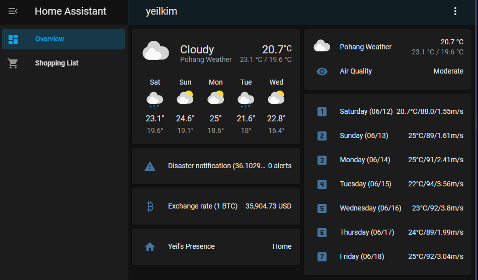

### Make my own IoT server using Homeassistant
made by Yeil Kim 21400155

## Welcome to Final Project For OSS Lab!

This git is for source codes for final project for OSS Lab class.  
Please feel free to look up the source codes for your use.  
All sources are from the homeassistant document  
You can check this link : https://www.home-assistant.io/docs/  

## What does this project do?

I wanted to make IoT server using raspberrypi, I don't have any real sensors in my own though.   
If I use "Homeassistant" components, I can show the air condition, wheather or other real time informations.  

Homeassistant can modify with .yaml files.  

## What opensource do I use?

During I have done my final project, I use Homeassistant, Samba mostly.  

Home Assistant is a free and open-source software for home automation that is designed to be the central control system for smart home devices with focus on local control and privacy.  

Samba is a software that allows a PC running Windows operating system to connect to a Linux or UNIX server and share files or printers.  

①	sudo apt-get install samba samba-common-bin  
②	sudo nano /etc/samba/smb.conf  
③	sudo smbpasswd -a pi   
④	sudo nano /etc/samba/smb.conf  

-you need to modify like below in last line of the smb.conf file  
[pi]  
comment = rpi samba server by girin  
path = /home/pi  
valid user = pi  
writable = yes  
read only = no  
browseable = yes  

⑤	sudo service smbd restart  
then, you can modify files easily in your window \\ipaddress\   

## How do I get started?  

You can download homeassistant following below orders.  
①	sudo apt-get update  
②	sudo apt-get upgrade -u  
③	sudo apt-get install python3 python3-venv python3-pip  
④	sudo useradd -rm homeassistant -G dialout, gpio  
⑤	cd /srv  
⑥	sudo mkdir homeassistant  
⑦	sudo chown homeassistant:homeassistant homeassistant  
⑧	sudo -u homeassistant -H -s  
⑨	cd /srv/homeassistant  
⑩	python3 -m venv .  
⑪	source bin/activate  
⑫	python3 -m pip install wheel  
⑬	pip install homeassistant  

now homeassistant download is done.  

you can implement homeassistant following below orders.  
①	sudo -u homeassistant -H -s  
②	cd  
③	source /srv/homeassistant/bin/activate  

now enter “IP address:8123” on your internet like the below. you can see the defualt HA dashboard.  

clone all my yaml files under your ~/.homeassistant directory  
restart homeassitant.  
you can see the dashboard like this!

## Where can I get more help, if I need it?

You can contact me through email, which is 21400155@handong.edu

## VIDEO PRESENTATION LINK HERE!
 <a href = "https://www.youtube.com/watch?v=lh3qTTqlZOY">Youtube video link click here!</a> 
 All c program were coded by myself, no copied sources were used in this project 
 if the hyperlink doesn't work - type in youtube.com/watch?v=lh3qTTqlZOY
